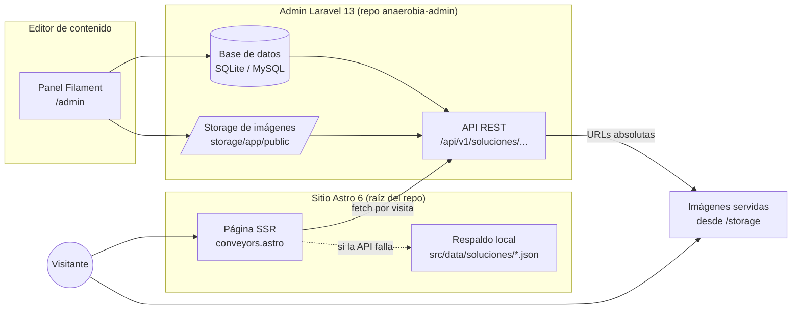
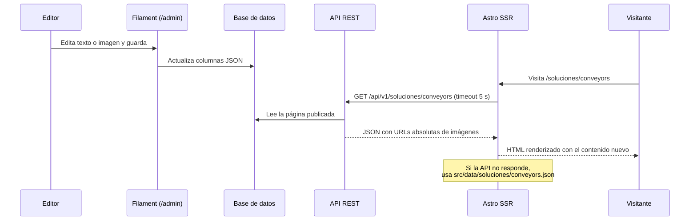

# Arquitectura del Sistema — Anaerobia Web + Admin

> Documento de referencia del proyecto de administración de contenido.
> Última actualización: 30 de julio de 2026

## Repositorios

El sistema vive en **dos repositorios independientes** para desacoplar los ciclos de deploy:
un push al admin jamás dispara el deploy del sitio en Vercel, y viceversa.

| Repositorio | Contenido | Deploy |
|---|---|---|
| [`jesanchezfuturite/anaerobia`](https://github.com/jesanchezfuturite/anaerobia) (rama `adminLaravel`) | Sitio Astro | Vercel (automático al hacer push) |
| [`selenebriones/anaerobia-admin`](https://github.com/selenebriones/anaerobia-admin) | Admin Laravel + Filament + API | Webserver PHP (independiente) |

El contrato entre ambos es la **API REST** (sección 5) y el modelo de contenido (sección 4).
Un cambio que modifique el modelo requiere commits coordinados en los dos repos.

## 1. Visión general

El sitio público (Astro) deja de tener el contenido "horneado" en el código: ahora lo consulta
en cada visita a una **API REST** servida por un **admin en Laravel + Filament**, donde el
cliente edita textos e imágenes sin tocar el diseño. Si el admin no está disponible, el sitio
se sirve con un **respaldo local** (JSON) y nunca se cae.



## 2. Stack tecnológico

| Capa | Tecnología | Repositorio |
|---|---|---|
| Sitio público | Astro 6 (SSR por página con `prerender = false`), Tailwind v4, React 19, GSAP | `anaerobia` |
| Panel admin | Laravel 13 + Filament 5 | `anaerobia-admin` |
| API de contenido | Laravel (rutas `routes/api.php`, solo lectura) | `anaerobia-admin` |
| Base de datos | SQLite en local (MySQL al desplegar, solo cambia el `.env`) | `anaerobia-admin` |
| Imágenes | Disco `public` de Laravel + `storage:link` | `anaerobia-admin` |

Todo el contenido editable vive en el admin: el sitio ya no usa ningún CMS adicional
(Keystatic fue retirado al completar la Fase 3).

## 3. Flujo de edición (cambios al instante)



No hay rebuilds ni deploys: el cambio guardado en el admin se ve en la siguiente recarga.

## 4. Modelo de contenido

El contenido vive en dos tablas:

| Tabla | Qué guarda | Forma |
|---|---|---|
| `solution_pages` | Las 10 páginas de soluciones | Una columna JSON por sección |
| `site_pages` | Resto del sitio: `homepage`, `navigation` | Una sola columna `data` con todas las secciones |

Una fila por página en la tabla `solution_pages`. Cada sección del diseño es una **columna JSON**
con estructura fija; el admin edita los valores, nunca la estructura ni las clases CSS.

```
solution_pages
├── slug (único, ej. "conveyors")     ├── name (nombre interno)
├── published (visible en la API)     ├── seo         { title, description }
├── hero         { badge, title, description, image }
├── intro        { title, paragraphs[{text}], image }
├── desafios     { title, description, image, tarjetas[{text}], items[{title, description}] }
├── cta1 / cta2  { title, description, button_label, button_url, image (solo cta2) }
├── ingenieria   { badge, title, description, cards[{title, description, image}] }
├── tipos        { badge, title, description,
│                  ubicacion { label, overhead_title, overhead_cards[{title,image}],
│                              floor_title, floor_cards[{title,image}] },
│                  operacion { label, title, description, items[{title,description}], image } }
├── resultados   { badge, title, description, cards[{text}] }
├── normatividad { badge, title, description, bullets[{text}] }
├── faqs         { badge, title, items[{question, answer}] }
└── galeria      { badge, title, images[{image, alt}] }
```

```
site_pages
├── key = "homepage"   → data { hero, soluciones, mantenimiento, gestion360,
│                               industrias, normativas, mapa, contacto }
└── key = "navigation" → data { links[{label, url, hasSubmenu, submenu[{label,url}]}] }
```

Reglas del modelo:

- **Los iconos SVG, alturas, animaciones GSAP y clases Tailwind viven en el código Astro**, no en la BD.
  Excepción: los iconos de la sección Industrias del inicio son marcado SVG guardado en los datos;
  se conservan al guardar pero no se exponen como campo editable en el panel.
- Las imágenes y videos se guardan como ruta relativa al disco `public` (`soluciones/uploads/...`);
  el trait `ResolvesMediaUrls` las convierte a URL absoluta al servir la API.
- Los formularios de Filament son **dinámicos**: `App\Filament\Support\DynamicFields` construye las
  pestañas y campos a partir de la forma del JSON de cada página, por lo que no hay que programar un
  formulario por página. El catálogo de páginas es fijo: no se pueden crear ni eliminar desde el panel.

## 5. API REST

| Método | Ruta | Descripción |
|---|---|---|
| GET | `/api/v1/soluciones` | Lista de páginas de soluciones publicadas (slug, nombre, fecha) |
| GET | `/api/v1/soluciones/{slug}` | Contenido completo de una página; 404 si no existe o no está publicada |
| GET | `/api/v1/paginas` | Lista de páginas del sitio publicadas (inicio, navegación) |
| GET | `/api/v1/paginas/{key}` | Contenido completo de una página del sitio; 404 si no existe o no está publicada |

El payload de cada solución incluye además `certificados`: los logos de certificaciones son
contenido compartido (se editan una sola vez en Inicio) y viajan en la misma respuesta para
que la sección de normatividad no necesite una segunda llamada.

- Solo lectura y sin autenticación por ahora (local). Al desplegar se puede endurecer con un token estático en header.
- El sitio la consume **del lado del servidor** (SSR), por lo que no hay problemas de CORS ni se expone la URL interna al navegador.

## 6. Estructura del repositorio

```
anaerobia/  (rama adminLaravel)           # ── Repo 1: sitio ──
├── src/
│   ├── pages/soluciones/         # conveyors.astro ya consume la API (piloto)
│   └── data/soluciones/          # Respaldos JSON por página (fallback)
├── public/images/                # Imágenes estáticas originales del sitio
├── .env                          # ADMIN_API_URL (no versionado; ver .env.example)
└── ARQUITECTURA.md               # Este documento

anaerobia-admin/                          # ── Repo 2: admin ──
├── app/Models/SolutionPage.php           # Modelo + transformación de payload
├── app/Filament/Resources/SolutionPages/ # Panel de edición (form, tabla, páginas)
├── app/Http/Controllers/Api/             # Controlador de la API
├── database/seeders/SolutionPageSeeder.php  # Contenido inicial extraído del sitio
├── routes/api.php                        # Rutas /api/v1
└── storage/app/public/soluciones/        # Imágenes administrables (no versionadas)
```

**No versionado por diseño:** `.env` de ambos repos, `database.sqlite`, `vendor/`,
imágenes en `storage/`. Ver sección 8 para recrearlos.

## 7. Decisiones de arquitectura y su porqué

| Decisión | Alternativa descartada | Razón |
|---|---|---|
| SSR por página (`prerender = false`) | Build estático + deploy hook | Requisito: los cambios deben verse al instante |
| Fallback JSON local por página | Depender 100 % de la API | El sitio público nunca se cae aunque el admin esté apagado |
| Columnas JSON por sección | Tablas normalizadas por componente | La estructura de las páginas es fija; JSON simplifica el formulario y la API sin perder validación |
| Filament | Admin a la medida (Blade/Vue) | CRUD, repeaters, uploads y roles listos de fábrica; semanas de ahorro |
| SQLite en local | MySQL desde el inicio | Cero configuración; el cambio a MySQL es solo `.env` cuando se defina hosting |
| Solo textos e imágenes editables | Editor de secciones libres | Protege el diseño; el cliente no puede romper el layout |

## 8. Puesta en marcha en local

```bash
# 1. Admin (primera vez)
git clone git@github.com:<cuenta>/anaerobia-admin.git
cd anaerobia-admin
composer install
cp .env.example .env && php artisan key:generate
php artisan migrate --seed --seeder=SolutionPageSeeder
php artisan storage:link
php artisan make:filament-user   # crear tu usuario
cp ../anaerobia/public/images/soluciones/conveyors/*.webp storage/app/public/soluciones/conveyors/

# 2. Levantar servidores (día a día)
cd anaerobia-admin && php artisan serve --port=8000   # admin + API → http://127.0.0.1:8000/admin
cd anaerobia && npm run dev                           # sitio       → http://127.0.0.1:4321
```

El sitio lee la URL de la API de la variable `ADMIN_API_URL` (archivo `.env` en la raíz,
copiar de `.env.example`).

Pruebas del admin: `php artisan test` dentro de `anaerobia-admin` (API, páginas despublicadas y render del panel).

## 9. Estado y hoja de ruta

- [x] **Fase 1 — Piloto Conveyors**: modelo, seeder, API, formulario Filament, SSR con fallback, pruebas
- [x] **Fase 2 — Réplica**: las 10 páginas de soluciones administrables (un seeder + JSON de respaldo por página; formulario Filament dinámico que se adapta a las secciones de cada página; contenido verificado idéntico contra el sitio original)
- [x] **Fase 3 — Homepage y navegación**: migradas al admin (tabla `site_pages`), Keystatic retirado por completo y todo el sitio en SSR para que los cambios de menú se vean al instante en cualquier página
- [ ] **Fase 4 — Páginas restantes**: nosotros, proyectos y casos de estudio
- [ ] **Fase 5 — Despliegue**: hosting del admin (MySQL, token de API, backups) y sitio Astro con adapter SSR; definir dominio para las imágenes
- [ ] **Fase 6 — Endurecimiento**: roles de usuario, conversión automática a WebP y tamaños responsivos al subir imágenes
